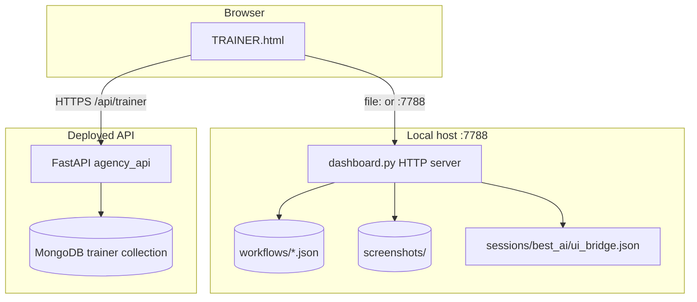

# Trainer — full rebuild specification

## Product summary

The **Trainer** is a single-page web app (`TRAINER.html`) that:

- Builds **named workflows** as ordered **steps** (`action_type` + fields).
- Persists workflows via HTTP (local JSON files **or** cloud MongoDB keyed by `X-API-Key`).
- On a **local** machine, triggers **real UI automation** (PyAutoGUI, vision, shell, clipboard) through `POST …/run`.
- Adds satellite features: **AI Media Studio**, **Website builder**, **Automation scheduler**, **ar™ bundles**, **Best AI™ bridge**, **Saved workflows** management, **campaign** tooling, **desktop export**, **permissions** gate.

## Layer diagram

## Source-of-truth files in the repo (not all copied here)

| Concern | Primary file | Notes |
|--------|---------------|--------|
| Full Trainer UI + client logic | `TRAINER.html` | Copied to `assets/TRAINER.html` |
| Local HTTP API + `run_workflow` + teach + automation + bundles + campaigns | `dashboard.py` | **~9k+ lines** — implement by reading sections: `_trainer_*`, `run_workflow`, `Handler` routes for paths used in `TRAINER.html` |
| Cloud trainer CRUD + teach + dry run only | `agency_api/trainer_service.py`, `agency_api/routes/trainer.py` | Copied under `code/` |
| FastAPI app mount | `agency_api/server.py` | Includes router for `/api/trainer` |
| Best AI synthesizer / bridge helpers | `dashboard.py` + `best_ai/` | Bridge path referenced in UI: `sessions/best_ai/ui_bridge.json` |

## Workflow document shape (both local JSON and Mongo `data`)

Top-level keys typically include:

- `workflow_name` (string) — same as filename stem locally (`workflows/{name}.json`).
- `steps` (array of step objects, ascending `step` number).
- `total_steps` (int) — denormalized count.
- `taught_at` (ISO string) — optional metadata.

Each **step** minimally has: `step`, `action_type`, `description`, `status`, and type-specific fields (see `STEP_TYPES_REFERENCE.md` and `WORKFLOW_JSON_EXAMPLE.json`).

## Client API base resolution (must match)

From `assets/TRAINER.html`:

- If `location.protocol === 'file:'` or origin is null → `API = 'http://localhost:7788'`.
- Else if `location.port === '7788'` → `API = location.origin` (e.g. `http://127.0.0.1:7788`).
- Else → `API = location.origin + '/api/trainer'` (cloud).

So **local routes are rooted at `/health`, `/teach/step`, …** not under `/api/trainer`.

## Authentication

- Optional **`X-API-Key`** header on fetches; value stored in `localStorage` key `agency_trainer_api_key` (constant `API_KEY_STORAGE` in HTML).
- Cloud: `TRAINER_REQUIRE_API_KEY` / `APP_MODE` gate anonymous access (see `trainer.py`).

## Rebuild checklist for a new codebase

1. **Data**: Implement workflow storage (JSON dir **or** Mongo with same document shape).
2. **Teach**: `POST` multipart `/teach/step` — parse fields in `API_AND_DATA.md`; for `click`, run vision on uploaded image when keys exist; persist `x`,`y`,`screenshot` filename, `live_vision` flag.
3. **CRUD**: `GET /workflows`, `GET /workflow/{name}`, `DELETE /workflow/{name}`, `DELETE /workflow/{name}/step/{n}`, `POST /workflow/{name}/join`, `POST /workflow/{name}/rename`, `POST /workflow/{name}/clone`, `POST /workflow/{name}/step/{n}/update` (parity with current `TRAINER.html`).
4. **Run**: `POST /run` with JSON `{ workflow_name, dry_run, mode }` — local executes; cloud returns dry-run list only.
5. **UI**: All tabs and fetches listed in `UI_PANELS.md` / grep `fetch(\`${API}` in `assets/TRAINER.html`.
6. **Automation / ar™ / campaigns**: Large surface — copy behavior from `dashboard.py` handlers for paths listed in `API_AND_DATA.md`.

## parity note: portal trainer

The repo also has `portal/trainer.html` — a related but **not identical** variant. This kit documents the **root `TRAINER.html`** (full feature set used with `dashboard.py`).
