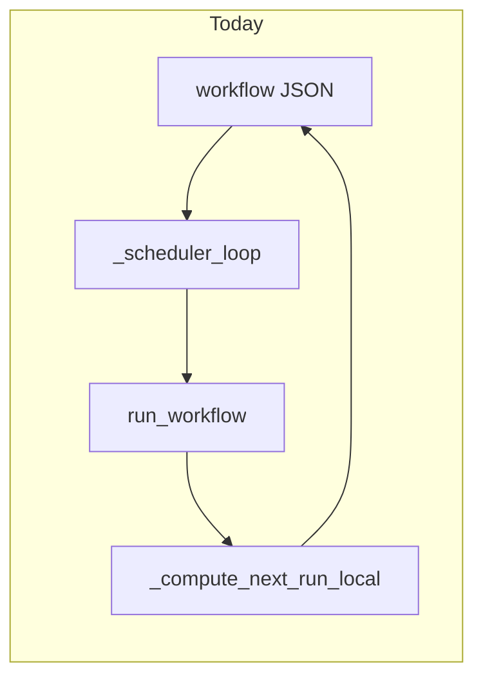

# Humanized scheduling and UX-drift resilience (plan only)

## Current baseline (what you already have)

- **Scheduler**: [`dashboard.py`](dashboard.py) `_scheduler_loop` loads each `workflows/*.json`, reads `automation`, and when due calls `run_workflow(..., dry_run=False, run_source="automation")`. After a run it sets `automation.next_run_at` via `_compute_next_run_local` ([`dashboard.py` around 3892–3940 and 4626–4637](dashboard.py)) — deterministic from `mode`, `daily_time`, `weekly_times`, or interval fields. Shape is normalized in `_ensure_workflow_automation_shape` ([~4059–4094](dashboard.py)).
- **WhatsApp**: End-of-run notify is `_send_whatsapp_run_notification` ([~3680–3776](dashboard.py)), gated by `TRAINER_WHATSAPP_NOTIFY` and optional send-workflow envs; per-workflow phone lives under `automation.whatsapp_number` (normalized there).
- **Dry run**: `run_workflow(..., dry_run=True)` already walks steps without clicking (with logging), including a branch for live-vision clicks that only prints intent ([~4992–5041](dashboard.py)).
- **Vision clicks (runtime)**: `_trainer_use_live_vision_click` + screenshot + `_analyse_click_with_retries(cap_path, desc)` ([~5961–6007](dashboard.py)); the **step `description`** is the primary semantic anchor for “what to find,” plus saved `x,y` fallback.

**Important constraint to state in product copy**: Automated runs only fire while the Trainer/desktop process is running and the machine is awake (today’s design). “Keep your PC on” is accurate for the current architecture unless you later add a cloud runner or OS wake timers.

---

## Feature 1 — Human-like posting schedule and notifications

### 1.1 Data model (workflow `automation` + bundle `schedule`)

Add fields (names illustrative; align with existing snake_case style):

- `posting_strategy`: `"fixed"` | `"humanized"` (default `"fixed"` for backward compatibility).
- **Humanized-only** (optional sub-object or flat keys):
  - `humanized_window_start` / `humanized_window_end` (HH:MM, local) — e.g. user’s “evening” band when posting is allowed.
  - `humanized_jitter_minutes` (int) — max random offset from a baseline, or sample uniformly in the window (pick one algorithm and document it).
  - `humanized_min_spacing_hours` (float, optional) — avoid clustering if user also runs manual posts.
  - `notify_next_run` (bool) — whether to WhatsApp the **upcoming** slot (not only completion).
- **Fixed daily acknowledgment** (for your caution UX):
  - `same_time_daily_risk_ack_at` (ISO timestamp) or `same_time_daily_risk_ack_version` (int bumped when copy changes) — set only after user confirms in UI.

Mirror the same knobs on **AR bundle** [`_normalize_bundle_schedule`](dashboard.py) if bundle-level scheduling should behave the same (your [`bundles/Social_Media_Package.json`](bundles/Social_Media_Package.json) uses `schedule` on the bundle).

### 1.2 Algorithm — “how does the agent decide the next post time?”

- **Fixed** (`posting_strategy == "fixed"`): Keep current `_compute_next_run_local` behavior.
- **Humanized** (`posting_strategy == "humanized"`):
  - When advancing `next_run_at` after a successful run (same place as today: ~4634–4637), call a new helper e.g. `_compute_next_run_humanized(auto, now_done)` instead of `_compute_next_run_local` when strategy is humanized.
  - **Sampling**: e.g. pick a random datetime uniformly in `[window_start, window_end]` on the **next calendar day** (or “next occurrence” if window spans midnight — define explicitly). Persist the chosen instant in `next_run_at` and optionally persist `last_picked_slot_reason` / seed for support logs (not shown to end users).
  - **Stability**: Use a deterministic PRNG seeded from `(workflow_name, calendar_date, scheduler_run_count)` if you want reproducible support debugging; otherwise `secrets`/`random` is fine.
  - **Same-day guard**: If `now_done` already passed into the window, decide whether the next slot is “later today” vs “tomorrow” (product choice; recommend “tomorrow” to avoid double-post same day unless interval mode).

### 1.3 WhatsApp and “keep PC on” copy

- **After schedule is computed** (enable automation, edit schedule, or post-run advance): if `notify_next_run` and a WhatsApp number is resolvable (`_resolve_whatsapp_number` / bundle notify map), build a **prefilled** message that includes:
  - Next run local time (human-readable timezone if you add tz later; today is naive local).
  - Explicit line: machine must be on and Trainer running until that time (honest given current scheduler).
- Reuse the same transport as `_send_whatsapp_run_notification` (wa.me / send-workflow pattern) but as a **separate** small function to avoid conflating “run completed” with “reminder.”
- Optional: **reminder** 30–60 minutes before `next_run_at` (requires scheduler tick or a short-interval check); today’s loop is “when due”; you may add a lightweight “upcoming notify” pass every N minutes or piggyback on existing periodic work.

### 1.4 UI / Trainer behavior (high level)

- In [`TRAINER.html`](TRAINER.html) / automation API handlers in [`dashboard.py`](dashboard.py) (POST paths that already touch `schedule_changed` ~7920–7940):
  - Radio: **Same time every day** vs **Let the agent pick a time (recommended)**.
  - If **Same time**: show static caution text (“Platforms may correlate rigid daily timing with automation; rare enforcement actions…”) + checkbox “I understand” that writes `same_time_daily_risk_ack_*` before allowing `posting_strategy` fixed with `mode=daily`.
  - If **Humanized**: show window pickers + optional “notify me on WhatsApp when the next slot is chosen.”

### 1.5 Risks and scope notes

- This does **not** guarantee anti-detection; it only reduces obvious periodicity. Legal/compliance copy should stay cautious.
- Bundle runs serialize children under one lock today; humanized **per-child** stagger vs **bundle-level** next run needs a product decision (simplest: humanize only the bundle’s `next_run_at`, children still run in sequence when the bundle fires).

---

## Feature 2 — Agent works when UX breaks (pre-flight dry run + drift escalation)

### 2.1 Concept

Treat each **click** (and optionally `open_url` / focus steps) as having a **run fingerprint** captured at train time or last successful run:

- Primary signal (already aligned with code): **vision resolution** using step `description` + fresh screenshot — same path as live run but in **`dry_run=True`** you currently log instead of failing early; extend with **structured checks**.

Optional second signal: normalized **saved anchor** `(trained_x, trained_y)` vs vision-proposed `(ix, iy)` distance in pixels — only meaningful when vision is on or when comparing two vision passes.

### 2.2 Pipeline (before automation or on demand)

1. **Pre-flight entry**: New function e.g. `validate_workflow_ui_dry(name) -> dict` that calls `run_workflow(name, dry_run=True, run_source="preflight", ...)` with a flag in `runtime_vars_seed` like `PREFLIGHT_DRIFT_CHECK=1` (so real dry-run behavior can branch to “collect metrics” without spamming WhatsApp).
2. **Per click step** (when `PREFLIGHT_DRIFT_CHECK`):
   - Capture screen, run the **same** `_analyse_click_with_retries` used in live mode (refactor so dry-run can invoke it read-only and get `x,y,confidence`).
   - Compare to **baseline** stored on the step, e.g. `step.ui_anchor = { "vision_x", "vision_y", "captured_at", "screenshot_hash" }` (populate on first successful live run or on “Save flow” in Trainer).
3. **If mismatch** (threshold: low confidence, or pixel delta > N, or vision throws):
   - **Retry once** from step 1 (full preflight) after a short settle wait — matches your “restart dry run.”
4. **If still mismatch** at step *k*:
   - Set workflow-level state `automation.preflight_status = "blocked"` with `blocked_step`, `human_message` built from `description` (“Please check whether ‘Post’ moved — we could not reliably find it.”).
   - **Notify** via WhatsApp (reuse number resolution) with deep link or instructions to open Trainer on that workflow.
   - **Do not** start the scheduled live run until cleared (scheduler should skip or reschedule with backoff).

### 2.3 “User confirms and requests update”

- **Trainer**: Add a minimal flow: “UX changed at step N — re-teach this step” button that focuses the step editor / launches re-capture for coordinates and re-saves `workflows/{name}.json`.
- **Desktop app**: Workflows already load from disk / encrypted paths via [`teach/runner_v1.py`](teach/runner_v1.py) and [`security/workflow_crypto.py`](security/workflow_crypto.py); after Trainer writes JSON (or `.enc` export), desktop picks up **on next load** or via an explicit “Sync flows” refresh — plan should name the actual hook in [`desktop.py`](desktop.py) once you implement (today desktop is thin; main behavior is `dashboard.py` + file storage).

### 2.4 Internal step linkage (user never sees “steps”)

- No new user-facing step list required: store drift baseline **on each step object** in the same JSON the runner already reads.
- Optionally add opaque `step_id` (UUID) stable across edits so analytics and WhatsApp deep links reference the same step even if `step` index shifts.

### 2.5 Feasibility

- **Yes, with scope boundaries**: Full reliability requires vision API availability and good `description` strings (already a hard requirement for live vision at 0,0). Steps without vision and with only fixed coordinates will still be fragile; the plan should recommend enabling **Live screen at run** for critical clicks or investing in the parallel [`standalone/ui_locator`](standalone/ui_locator) label-based path for native-style apps.

---

## Suggested implementation order (when you exit plan mode)

1. Schema + `_compute_next_run_humanized` + scheduler integration + persistence tests around `next_run_at`.
2. Trainer/API + caution acknowledgment for fixed daily.
3. WhatsApp “next run” notification helper + optional reminder tick.
4. Preflight dry-run refactor (shared vision call) + step-level `ui_anchor` + scheduler gate.
5. Trainer “re-teach step N” UX and clearing `preflight_status`.

## Files likely touched later (implementation)

- [`dashboard.py`](dashboard.py) — scheduler, `run_workflow`, WhatsApp helpers, new preflight.
- [`TRAINER.html`](TRAINER.html) — automation UI.
- Workflow JSON samples under [`bundles/`](bundles/) — documentation defaults only if you choose to update samples.
- Tests: new cases beside any existing scheduler tests (grep `pytest` / `_compute_next_run` in [`tests/`](tests/)).
